# Netty 聊天室 - 系统详细设计说明书

## 1. 引言

### 1.1 项目背景

本项目是一个基于 Netty 框架的 TCP 聊天室系统，采用 C/S 架构，支持多客户端实时通信。项目作为学习 Netty 网络编程的实践项目，重点掌握：

- Netty 的 EventLoop 线程模型与 Pipeline 机制
- 自定义二进制协议的编解码设计
- JDK 17 sealed class 在消息分发中的应用
- ChannelGroup 与 ConcurrentHashMap 的并发管理

### 1.2 功能边界

| 功能 | 范围 |
|------|------|
| 多客户端连接与消息广播 | ✅ 支持 |
| 上下线通知 | ✅ 支持 |
| 私聊（@某人） | ✅ 支持 |
| 昵称设置（/name） | ✅ 支持 |
| 退出（/quit） | ✅ 支持 |
| 用户认证/注册 | ❌ 不做 |
| 消息持久化 | ❌ 不做 |
| Web 前端 | ❌ 不做 |
| 文件传输 | ❌ 不做 |

### 1.3 术语定义

| 术语 | 说明 |
|------|------|
| Pipeline | Netty 中 Channel 的处理器链，包含多个 Handler |
| Handler | Netty 中处理入站/出站事件的处理器 |
| ChannelGroup | Netty 提供的 Channel 集合管理工具，支持批量操作 |
| EventLoop | Netty 的事件循环线程，负责处理 I/O 事件 |
| sealed class | JDK 17 引入的密封类，限制子类继承 |
| 粘包/拆包 | TCP 协议中多个数据包合并或一个数据包被拆分的现象 |

---

## 2. 系统总体架构

### 2.1 架构概览

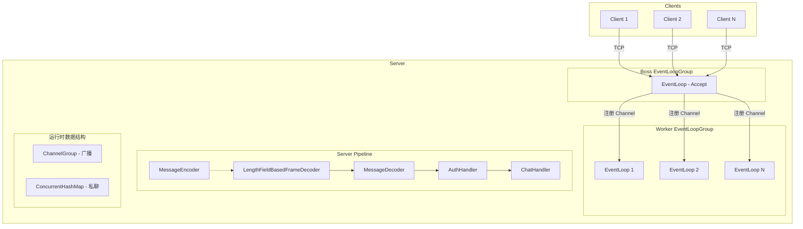

### 2.2 技术选型

| 组件 | 版本 | 用途 |
|------|------|------|
| JDK | 17 | 语言基础，使用 sealed class 特性 |
| Netty | 4.1.108.Final | 网络通信框架 |
| Gson | 2.11.0 | JSON 序列化/反序列化 |
| SLF4J Simple | 2.0.13 | 日志输出 |

### 2.3 线程模型

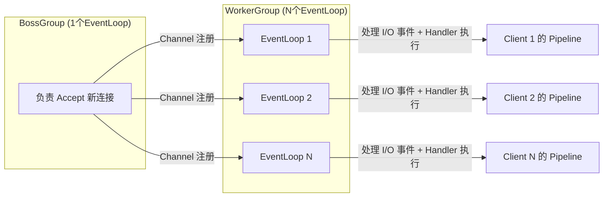

**关键点：**
- BossGroup 只需 1 个 EventLoop，负责接收新连接
- WorkerGroup 默认线程数 = CPU 核心数 × 2，每个 EventLoop 负责多个 Channel
- 同一个 Channel 的所有 I/O 事件由同一个 EventLoop 处理，无需同步

---

## 3. 通信协议设计

### 3.1 报文格式

```
 0                   1                   2                   3
 0 1 2 3 4 5 6 7 8 9 0 1 2 3 4 5 6 7 8 9 0 1 2 3 4 5 6 7 8 9 0 1
+-+-+-+-+-+-+-+-+-+-+-+-+-+-+-+-+-+-+-+-+-+-+-+-+-+-+-+-+-+-+-+-+
|                         Length (4 bytes)                       |
|                    (不含自身 4 字节)                             |
+-+-+-+-+-+-+-+-+-+-+-+-+-+-+-+-+-+-+-+-+-+-+-+-+-+-+-+-+-+-+-+-+
|      Type     |                                               |
|    (1 byte)   |              JSON Body (变长)                   |
|               |               (UTF-8 编码)                      |
+-+-+-+-+-+-+-+-+-+-+-+-+-+-+-+-+-+-+-+-+-+-+-+-+-+-+-+-+-+-+-+-+
```

| 字段 | 长度 | 说明 |
|------|------|------|
| Length | 4 字节 (int) | 后续内容长度 = Type(1B) + JSON Body 长度 |
| Type | 1 字节 (byte) | 消息类型编码，见 3.2 |
| JSON Body | 变长 | Gson 序列化的消息体，UTF-8 编码 |

### 3.2 消息类型编码

| 类型 | Type 值 | 方向 | 用途 |
|------|---------|------|------|
| CHAT | 1 | 客户端→服务端→广播 | 群聊消息 |
| PRIVATE | 2 | 客户端→服务端→目标客户端 | 私聊消息 |
| SYSTEM | 3 | 服务端→客户端 | 系统通知 |
| COMMAND | 4 | 客户端→服务端 | 命令请求 |

### 3.3 编解码流程

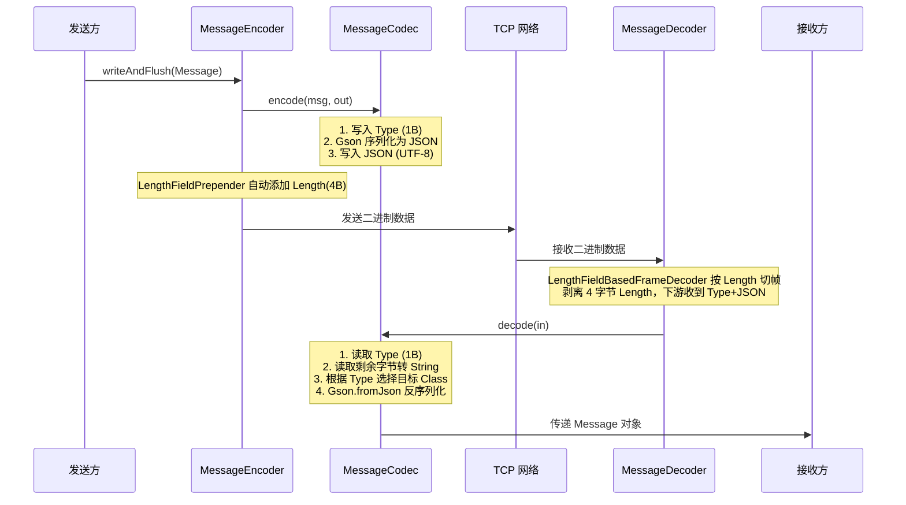

### 3.4 MessageCodec 编码实现

```java
public void encode(Message msg, ByteBuf out) {
    // 1. 写入消息类型 (1 字节)
    out.writeByte(msg.getType().getCode());

    // 2. 将 Message 序列化为 JSON 字节数组
    byte[] jsonBytes = gson.toJson(msg).getBytes(StandardCharsets.UTF_8);

    // 3. 写入 JSON Body
    out.writeBytes(jsonBytes);
}
```

**说明：** Length 字段由 Netty 内置的 `LengthFieldPrepender` 自动添加，无需手动写入。

### 3.5 MessageCodec 解码实现

```java
public Message decode(ByteBuf in) {
    // 1. 读取消息类型 (1 字节)
    byte typeCode = in.readByte();

    // 2. 读取剩余字节作为 JSON Body
    int readableBytes = in.readableBytes();
    byte[] jsonBytes = new byte[readableBytes];
    in.readBytes(jsonBytes);
    String json = new String(jsonBytes, StandardCharsets.UTF_8);

    // 3. 根据 Type 选择目标 Class
    Class<? extends Message> targetClass = switch (MessageType.fromCode(typeCode)) {
        case CHAT    -> ChatMessage.class;
        case PRIVATE -> PrivateMessage.class;
        case SYSTEM  -> SystemMessage.class;
        case COMMAND -> CommandMessage.class;
    };

    // 4. 反序列化
    return gson.fromJson(json, targetClass);
}
```

**关键点：** Gson 无法自动处理 sealed class 的多态反序列化，必须根据 Type 字节手动选择目标 Class。

### 3.6 粘包/拆包处理

使用 Netty 内置的 `LengthFieldBasedFrameDecoder` 解决：

```java
new LengthFieldBasedFrameDecoder(
    maxFrameLength,        // 最大帧长度，如 1024 * 64
    lengthFieldOffset,     // Length 字段偏移量 = 0
    lengthFieldLength,     // Length 字段长度 = 4
    lengthAdjustment,      // Length 调整值 = 0（Length 不含自身 4 字节，但后续内容刚好是 Type+JSON）
    initialBytesToStrip    // 剥离字节数 = 4（剥离 Length 字段，下游只收到 Type+JSON）
)
```

**效果：**
- 入站数据 `[Length][Type][JSON]` → 下游收到 `[Type][JSON]`
- 自动处理粘包（多个消息合并）和拆包（一个消息被拆分）

---

## 4. 消息模型设计

### 4.1 类图

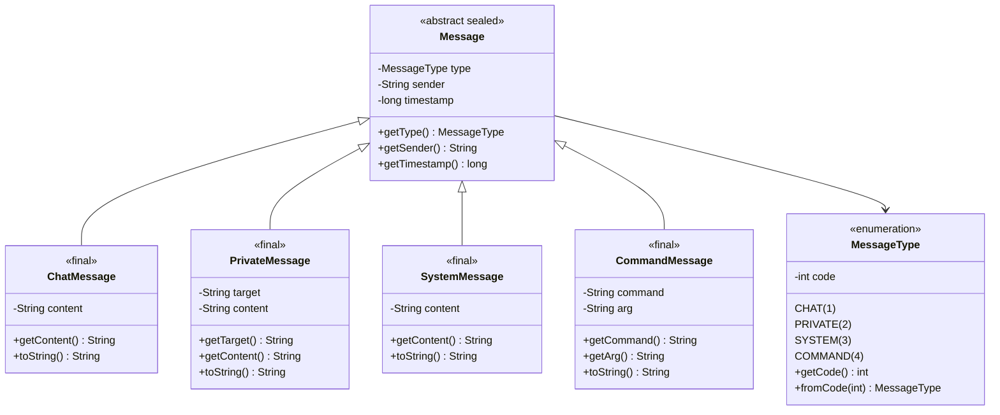

### 4.2 消息类型字段定义

#### ChatMessage（群聊消息）

| 字段 | 类型 | 说明 |
|------|------|------|
| type | MessageType | 固定为 CHAT |
| sender | String | 发送者昵称 |
| timestamp | long | 发送时间戳 |
| content | String | 消息内容 |

**JSON 示例：**
```json
{
  "type": "CHAT",
  "sender": "Tom",
  "timestamp": 1718700000000,
  "content": "大家好"
}
```

#### PrivateMessage（私聊消息）

| 字段 | 类型 | 说明 |
|------|------|------|
| type | MessageType | 固定为 PRIVATE |
| sender | String | 发送者昵称 |
| timestamp | long | 发送时间戳 |
| target | String | 目标用户昵称 |
| content | String | 消息内容 |

**JSON 示例：**
```json
{
  "type": "PRIVATE",
  "sender": "Tom",
  "timestamp": 1718700000000,
  "target": "Jerry",
  "content": "你好"
}
```

#### SystemMessage（系统消息）

| 字段 | 类型 | 说明 |
|------|------|------|
| type | MessageType | 固定为 SYSTEM |
| sender | String | 固定为 "SYSTEM" |
| timestamp | long | 发送时间戳 |
| content | String | 系统通知内容 |

**JSON 示例：**
```json
{
  "type": "SYSTEM",
  "sender": "SYSTEM",
  "timestamp": 1718700000000,
  "content": "Tom 加入了聊天室"
}
```

#### CommandMessage（命令消息）

| 字段 | 类型 | 说明 |
|------|------|------|
| type | MessageType | 固定为 COMMAND |
| sender | String | 发送者昵称 |
| timestamp | long | 发送时间戳 |
| command | String | 命令名称（如 "name"） |
| arg | String | 命令参数（可为 null） |

**JSON 示例：**
```json
{
  "type": "COMMAND",
  "sender": "Tom",
  "timestamp": 1718700000000,
  "command": "name",
  "arg": "NewTom"
}
```

### 4.3 MessageType.fromCode 实现

```java
public static MessageType fromCode(int code) {
    for (MessageType type : values()) {
        if (type.code == code) {
            return type;
        }
    }
    throw new IllegalArgumentException("未知的消息类型编码: " + code);
}
```

---

## 5. 服务端设计

### 5.1 ChatServer 启动流程

```java
public static void main(String[] args) {
    // 1. 创建线程组
    EventLoopGroup bossGroup = new NioEventLoopGroup(1);   // 接收连接
    EventLoopGroup workerGroup = new NioEventLoopGroup();  // 处理 I/O

    try {
        ServerBootstrap bootstrap = new ServerBootstrap();
        bootstrap.group(bossGroup, workerGroup)
                .channel(NioServerSocketChannel.class)
                .childHandler(new ChatServerInitializer());

        // 2. 绑定端口，同步等待
        ChannelFuture future = bootstrap.bind(8080).sync();
        System.out.println("聊天室服务端启动，监听端口: 8080");

        // 3. 阻塞直到服务端 Channel 关闭
        future.channel().closeFuture().sync();
    } finally {
        bossGroup.shutdownGracefully();
        workerGroup.shutdownGracefully();
    }
}
```

### 5.2 服务端 Pipeline 组装

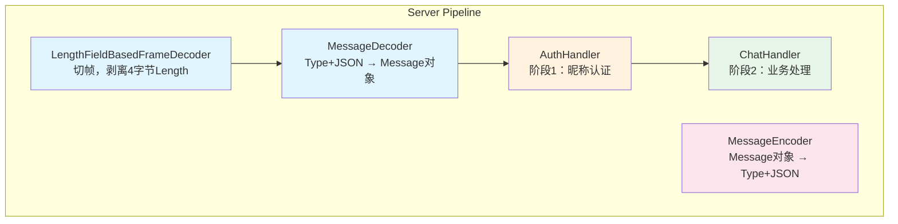

**Pipeline 组装伪代码：**

```java
// ChatServerInitializer.initChannel(SocketChannel ch)
protected void initChannel(SocketChannel ch) {
    ChannelPipeline pipeline = ch.pipeline();

    // 入站处理器（按顺序执行）
    pipeline.addLast("frameDecoder", new LengthFieldBasedFrameDecoder(
            65535, 0, 4, 0, 4));
    pipeline.addLast("messageDecoder", new MessageDecoder());

    // 出站处理器
    pipeline.addLast("messageEncoder", new MessageEncoder());

    // 业务处理器（入站）
    pipeline.addLast("authHandler", new AuthHandler());
    pipeline.addLast("chatHandler", new ChatHandler());
}
```

**处理器执行顺序：**
- **入站：** LengthFieldBasedFrameDecoder → MessageDecoder → AuthHandler → ChatHandler
- **出站：** MessageEncoder（反向查找，从尾到头）

### 5.3 AuthHandler - 昵称认证

AuthHandler 负责连接建立后的第一阶段：昵称认证。认证完成后自动从 Pipeline 中移除自身。

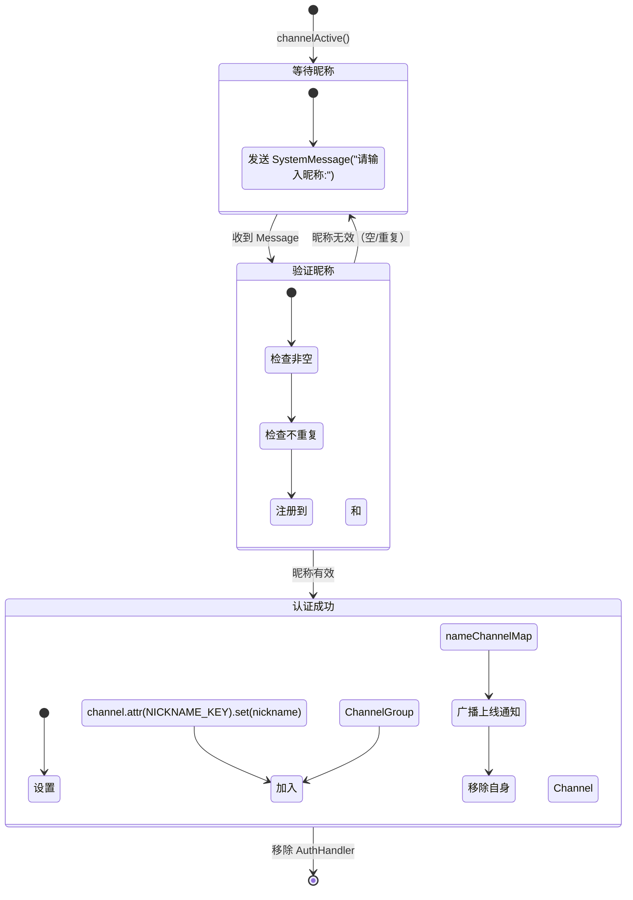

**核心实现伪代码：**

```java
public class AuthHandler extends SimpleChannelInboundHandler<Message> {
    public static final AttributeKey<String> NICKNAME_KEY =
            AttributeKey.valueOf("nickname");

    // 连接建立时，发送提示
    @Override
    public void channelActive(ChannelHandlerContext ctx) {
        ctx.writeAndFlush(new SystemMessage("SYSTEM", "请输入昵称:"));
    }

    // 收到第一条消息，验证昵称
    @Override
    protected void channelRead0(ChannelHandlerContext ctx, Message msg) {
        // 1. 只接受 ChatMessage（用户输入的第一条文本）
        if (!(msg instanceof ChatMessage chatMsg)) {
            ctx.writeAndFlush(new SystemMessage("SYSTEM", "请输入文本作为昵称"));
            return;
        }

        String nickname = chatMsg.getContent().trim();

        // 2. 校验：不能为空
        if (nickname.isEmpty()) {
            ctx.writeAndFlush(new SystemMessage("SYSTEM", "昵称不能为空，请重新输入:"));
            return;
        }

        // 3. 校验：不能重复
        if (ChatHandler.nameChannelMap.containsKey(nickname)) {
            ctx.writeAndFlush(new SystemMessage("SYSTEM", "昵称已被占用，请重新输入:"));
            return;
        }

        // 4. 认证通过：注册到管理结构
        ctx.channel().attr(NICKNAME_KEY).set(nickname);
        ChatHandler.channels.add(ctx.channel());
        ChatHandler.nameChannelMap.put(nickname, ctx.channel());

        // 5. 通知客户端
        ctx.writeAndFlush(new SystemMessage("SYSTEM",
                "欢迎加入聊天室，" + nickname + "!"));

        // 6. 广播上线通知
        ChatHandler.channels.writeAndFlush(new SystemMessage("SYSTEM",
                nickname + " 加入了聊天室"));

        // 7. 从 Pipeline 中移除自身，后续消息由 ChatHandler 处理
        ctx.pipeline().remove(this);
    }

    @Override
    public void exceptionCaught(ChannelHandlerContext ctx, Throwable cause) {
        cause.printStackTrace();
        ctx.close();
    }
}
```

### 5.4 ChatHandler - 业务消息处理

ChatHandler 负责认证后的所有消息处理，是核心业务处理器。

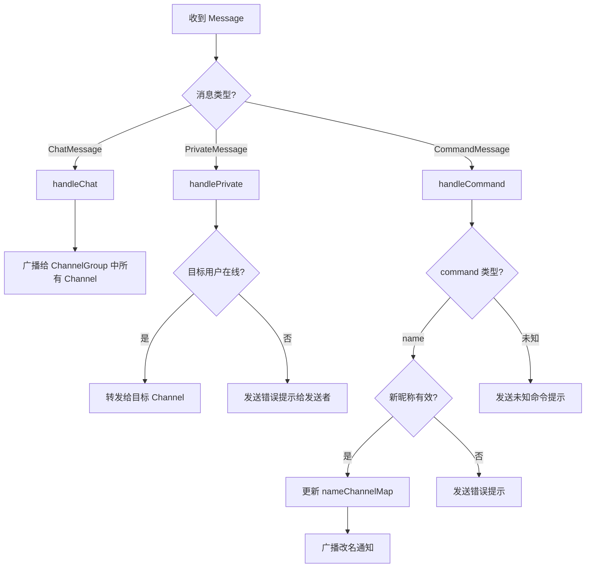

**核心实现伪代码：**

```java
public class ChatHandler extends SimpleChannelInboundHandler<Message> {
    // 在线 Channel 集合（广播用）
    static final ChannelGroup channels =
            new DefaultChannelGroup(GlobalEventExecutor.INSTANCE);
    // 昵称 → Channel 映射（私聊用）
    static final ConcurrentMap<String, Channel> nameChannelMap =
            new ConcurrentHashMap<>();

    @Override
    protected void channelRead0(ChannelHandlerContext ctx, Message msg) {
        if (msg instanceof ChatMessage chatMsg) {
            handleChat(ctx, chatMsg);
        } else if (msg instanceof PrivateMessage privateMsg) {
            handlePrivate(ctx, privateMsg);
        } else if (msg instanceof CommandMessage cmdMsg) {
            handleCommand(ctx, cmdMsg);
        }
    }

    // --- 群聊广播 ---
    private void handleChat(ChannelHandlerContext ctx, ChatMessage msg) {
        // 广播给所有人（包括发送者）
        channels.writeAndFlush(msg);
    }

    // --- 私聊转发 ---
    private void handlePrivate(ChannelHandlerContext ctx, PrivateMessage msg) {
        Channel targetChannel = nameChannelMap.get(msg.getTarget());
        if (targetChannel != null) {
            // 目标在线：转发
            targetChannel.writeAndFlush(msg);
        } else {
            // 目标不在线：通知发送者
            ctx.writeAndFlush(new SystemMessage("SYSTEM",
                    "用户 " + msg.getTarget() + " 不在线"));
        }
    }

    // --- 命令处理 ---
    private void handleCommand(ChannelHandlerContext ctx, CommandMessage msg) {
        if ("name".equals(msg.getCommand())) {
            handleRename(ctx, msg);
        } else {
            ctx.writeAndFlush(new SystemMessage("SYSTEM",
                    "未知命令: " + msg.getCommand()));
        }
    }

    // --- 改名逻辑 ---
    private void handleRename(ChannelHandlerContext ctx, CommandMessage msg) {
        String oldName = ctx.channel().attr(AuthHandler.NICKNAME_KEY).get();
        String newName = msg.getArg();

        // 校验：不能为空
        if (newName == null || newName.trim().isEmpty()) {
            ctx.writeAndFlush(new SystemMessage("SYSTEM", "昵称不能为空"));
            return;
        }

        // 校验：不能重复
        if (nameChannelMap.containsKey(newName)) {
            ctx.writeAndFlush(new SystemMessage("SYSTEM", "昵称已被占用"));
            return;
        }

        // 更新映射
        nameChannelMap.remove(oldName);
        nameChannelMap.put(newName, ctx.channel());
        ctx.channel().attr(AuthHandler.NICKNAME_KEY).set(newName);

        // 广播改名通知
        channels.writeAndFlush(new SystemMessage("SYSTEM",
                oldName + " 改名为 " + newName));
    }

    // --- 下线处理 ---
    @Override
    public void channelInactive(ChannelHandlerContext ctx) {
        String nickname = ctx.channel().attr(AuthHandler.NICKNAME_KEY).get();

        // 从管理结构中移除
        nameChannelMap.remove(nickname);
        channels.remove(ctx.channel());

        // 广播下线通知
        channels.writeAndFlush(new SystemMessage("SYSTEM",
                nickname + " 离开了聊天室"));
    }

    @Override
    public void exceptionCaught(ChannelHandlerContext ctx, Throwable cause) {
        cause.printStackTrace();
        ctx.close();
    }
}
```

### 5.5 客户端管理数据结构

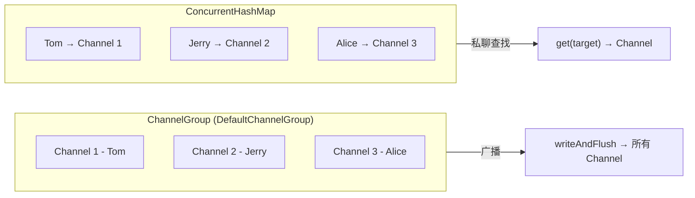

**职责划分：**
- `ChannelGroup`：广播消息、自动清理断开的 Channel
- `ConcurrentHashMap`：按昵称查找 Channel，支持私聊和改名

---

## 6. 客户端设计

### 6.1 客户端 Pipeline 组装

```java
// ChatClientInitializer.initChannel(SocketChannel ch)
protected void initChannel(SocketChannel ch) {
    ChannelPipeline pipeline = ch.pipeline();

    // 入站
    pipeline.addLast("frameDecoder", new LengthFieldBasedFrameDecoder(
            65535, 0, 4, 0, 4));
    pipeline.addLast("messageDecoder", new MessageDecoder());

    // 出站
    pipeline.addLast("messageEncoder", new MessageEncoder());

    // 业务
    pipeline.addLast("clientHandler", new ClientHandler());
}
```

**与服务端的区别：** 无需 AuthHandler 和 ChatHandler，客户端只负责发送用户输入和接收展示。

### 6.2 ChatClient 启动与输入解析

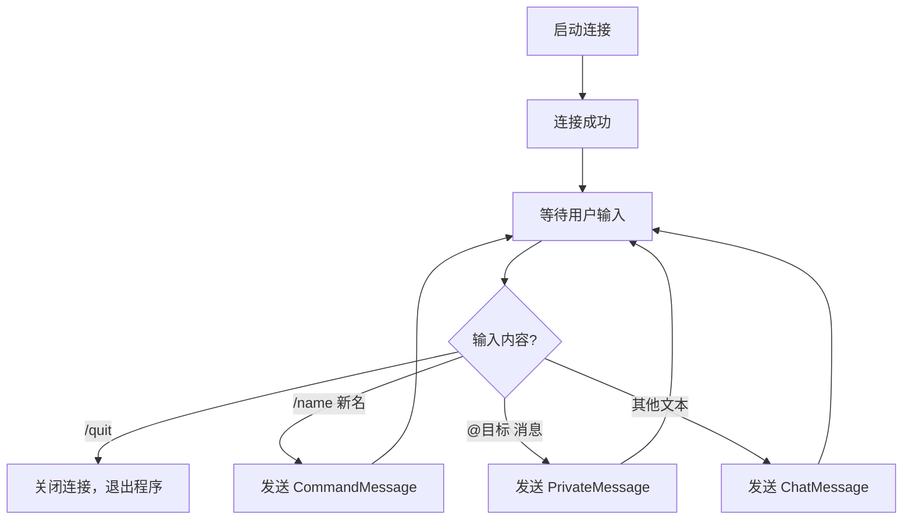

**核心实现伪代码：**

```java
public static void main(String[] args) throws InterruptedException {
    EventLoopGroup group = new NioEventLoopGroup();
    try {
        Bootstrap bootstrap = new Bootstrap();
        bootstrap.group(group)
                .channel(NioSocketChannel.class)
                .handler(new ChatClientInitializer());

        // 连接服务器
        Channel channel = bootstrap.connect("127.0.0.1", 8080).sync().channel();

        // 读取用户输入
        Scanner scanner = new Scanner(System.in);
        while (true) {
            String line = scanner.nextLine().trim();
            if (line.isEmpty()) continue;

            if ("/quit".equals(line)) {
                channel.close();
                break;
            } else if (line.startsWith("/name ")) {
                String newName = line.substring(6).trim();
                channel.writeAndFlush(
                        new CommandMessage("?", "name", newName));
            } else if (line.startsWith("@")) {
                // 解析 "@目标 消息" 格式
                int spaceIndex = line.indexOf(' ');
                if (spaceIndex > 1) {
                    String target = line.substring(1, spaceIndex);
                    String content = line.substring(spaceIndex + 1);
                    channel.writeAndFlush(
                            new PrivateMessage("?", target, content));
                }
            } else {
                channel.writeAndFlush(
                        new ChatMessage("?", line));
            }
        }
    } finally {
        group.shutdownGracefully();
    }
}
```

**说明：** sender 字段由服务端在转发时替换为实际昵称，客户端发送时可填写占位符。

### 6.3 ClientHandler 消息展示

```java
public class ClientHandler extends SimpleChannelInboundHandler<Message> {

    @Override
    protected void channelRead0(ChannelHandlerContext ctx, Message msg) {
        if (msg instanceof ChatMessage chatMsg) {
            System.out.printf("[%s] %s: %s%n",
                    chatMsg.getType(), chatMsg.getSender(), chatMsg.getContent());
        } else if (msg instanceof PrivateMessage privateMsg) {
            System.out.printf("[私聊] %s → 你: %s%n",
                    privateMsg.getSender(), privateMsg.getContent());
        } else if (msg instanceof SystemMessage systemMsg) {
            System.out.printf("[系统] %s%n", systemMsg.getContent());
        } else {
            System.out.println(msg);
        }
    }

    @Override
    public void channelInactive(ChannelHandlerContext ctx) {
        System.out.println("与服务器断开连接");
        System.exit(0);
    }

    @Override
    public void exceptionCaught(ChannelHandlerContext ctx, Throwable cause) {
        cause.printStackTrace();
        ctx.close();
    }
}
```

---

## 7. 异常处理与连接生命周期

### 7.1 连接生命周期状态图

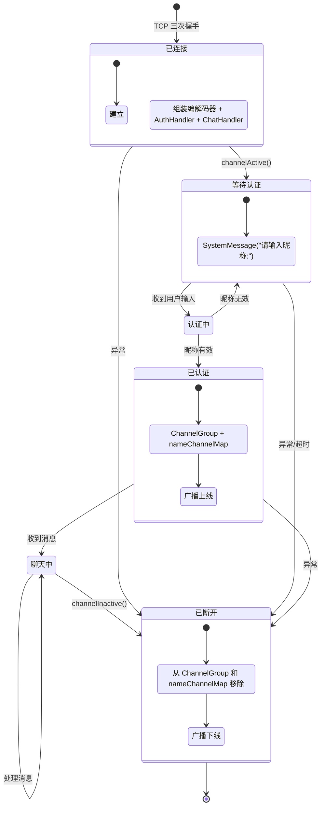

### 7.2 异常处理策略

| 位置 | 异常类型 | 处理方式 |
|------|----------|----------|
| AuthHandler | 所有异常 | 打印日志 → 关闭连接 |
| ChatHandler | 所有异常 | 打印日志 → 关闭连接 |
| ClientHandler | 所有异常 | 打印日志 → 关闭连接 |
| MessageDecoder | 解码失败 | 抛出异常 → 触发 exceptionCaught |
| MessageEncoder | 编码失败 | 抛出异常 → 触发 exceptionCaught |
| LengthFieldBasedFrameDecoder | 帧超长 | 抛出 TooLongFrameException |

**统一异常处理模式：**

```java
@Override
public void exceptionCaught(ChannelHandlerContext ctx, Throwable cause) {
    cause.printStackTrace();  // 记录日志
    ctx.close();              // 关闭连接，触发 channelInactive 清理
}
```

**异常传播链路：**

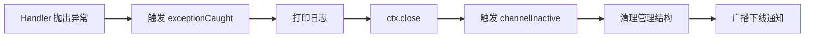

---

## 8. 开发实施计划

### 里程碑总览

```mermaid
gantt
    title 开发里程碑
    dateFormat  X
    axisFormat %s

    section 里程碑1 - 协议编解码
    MessageType.fromCode       :a1, 0, 1
    MessageCodec.encode        :a2, after a1, 1
    MessageCodec.decode        :a3, after a2, 1
    MessageEncoder             :a4, after a3, 1
    MessageDecoder             :a5, after a4, 1

    section 里程碑2 - 服务端 Pipeline
    ChatServerInitializer      :b1, after a5, 1
    编解码集成测试              :b2, after b1, 1

    section 里程碑3 - 客户端骨架
    ChatClientInitializer      :c1, after b2, 1
    ChatClient 输入解析         :c2, after c1, 1
    ClientHandler              :c3, after c2, 1

    section 里程碑4 - 认证与广播
    AuthHandler                :d1, after c3, 1
    ChatHandler 群聊广播        :d2, after d1, 1
    上下线通知                  :d3, after d2, 1

    section 里程碑5 - 私聊与命令
    ChatHandler 私聊           :e1, after d3, 1
    ChatHandler 改名命令        :e2, after e1, 1
    端到端测试                  :e3, after e2, 1
```

---

### 里程碑 1：协议编解码（基础层）

**目标：** 实现消息的二进制编解码，确保 Message 对象能正确转换为字节流并还原。

#### 任务 1.1：实现 MessageType.fromCode()

| 项目 | 内容 |
|------|------|
| 文件 | `common/message/MessageType.java` |
| 方法 | `fromCode(int code)` |
| 优先级 | P0（后续所有任务依赖） |

```java
// 实现要点：遍历枚举 values()，匹配 code，未匹配抛 IllegalArgumentException
public static MessageType fromCode(int code) {
    for (MessageType type : values()) {
        if (type.code == code) {
            return type;
        }
    }
    throw new IllegalArgumentException("未知的消息类型编码: " + code);
}
```

#### 任务 1.2：实现 MessageCodec.encode()

| 项目 | 内容 |
|------|------|
| 文件 | `common/protocol/MessageCodec.java` |
| 方法 | `encode(Message msg, ByteBuf out)` |
| 依赖 | Gson 实例 |

```java
// 实现要点：
// 1. 写入 type.getCode() 为 1 字节
// 2. gson.toJson(msg) 转 JSON 字符串
// 3. JSON 字符串转 UTF-8 字节数组写入 ByteBuf
public void encode(Message msg, ByteBuf out) {
    out.writeByte(msg.getType().getCode());
    byte[] json = gson.toJson(msg).getBytes(StandardCharsets.UTF_8);
    out.writeBytes(json);
}
```

#### 任务 1.3：实现 MessageCodec.decode()

| 项目 | 内容 |
|------|------|
| 文件 | `common/protocol/MessageCodec.java` |
| 方法 | `decode(ByteBuf in)` |
| 依赖 | MessageType.fromCode() |

```java
// 实现要点：
// 1. 读取 1 字节 typeCode
// 2. 读取剩余字节转 JSON 字符串
// 3. 根据 typeCode 选择目标 Class
// 4. gson.fromJson(json, targetClass)
public Message decode(ByteBuf in) {
    byte typeCode = in.readByte();
    byte[] bytes = new byte[in.readableBytes()];
    in.readBytes(bytes);
    String json = new String(bytes, StandardCharsets.UTF_8);

    Class<? extends Message> clazz = switch (MessageType.fromCode(typeCode)) {
        case CHAT    -> ChatMessage.class;
        case PRIVATE -> PrivateMessage.class;
        case SYSTEM  -> SystemMessage.class;
        case COMMAND -> CommandMessage.class;
    };
    return gson.fromJson(json, clazz);
}
```

#### 任务 1.4：实现 MessageEncoder

| 项目 | 内容 |
|------|------|
| 文件 | `common/protocol/MessageEncoder.java` |
| 方法 | `encode(ChannelHandlerContext, Message, ByteBuf)` |

```java
// 实现要点：一行代码，委托给 codec.encode()
@Override
protected void encode(ChannelHandlerContext ctx, Message msg, ByteBuf out) {
    codec.encode(msg, out);
}
```

#### 任务 1.5：实现 MessageDecoder

| 项目 | 内容 |
|------|------|
| 文件 | `common/protocol/MessageDecoder.java` |
| 方法 | `decode(ChannelHandlerContext, ByteBuf, List<Object>)` |

```java
// 实现要点：一行代码，委托给 codec.decode()，结果加入 out 列表
@Override
protected void decode(ChannelHandlerContext ctx, ByteBuf in, List<Object> out) {
    out.add(codec.decode(in));
}
```

#### 验证方式

编写单元测试，验证 `encode → decode` 的往返一致性：

```java
@Test
void testCodecRoundTrip() {
    MessageCodec codec = new MessageCodec();
    ChatMessage original = new ChatMessage("Tom", "Hello");

    ByteBuf buf = Unpooled.buffer();
    codec.encode(original, buf);
    Message decoded = codec.decode(buf);

    assertInstanceOf(ChatMessage.class, decoded);
    assertEquals("Tom", ((ChatMessage) decoded).getSender());
    assertEquals("Hello", ((ChatMessage) decoded).getContent());
}
```

---

### 里程碑 2：服务端 Pipeline

**目标：** 组装服务端 Pipeline，实现从 TCP 字节流到 Message 对象的完整链路。

#### 任务 2.1：实现 ChatServerInitializer

| 项目 | 内容 |
|------|------|
| 文件 | `server/ChatServerInitializer.java` |
| 方法 | `initChannel(SocketChannel ch)` |

```java
// 实现要点：按顺序添加处理器
@Override
protected void initChannel(SocketChannel ch) {
    ChannelPipeline p = ch.pipeline();
    p.addLast("frameDecoder", new LengthFieldBasedFrameDecoder(65535, 0, 4, 0, 4));
    p.addLast("messageDecoder", new MessageDecoder());
    p.addLast("messageEncoder", new MessageEncoder());
    p.addLast("chatHandler", new ChatHandler());  // 暂时只加 ChatHandler 做 echo 测试
}
```

#### 验证方式

1. 启动 ChatServer
2. 用 NetCat 或自定义测试客户端发送手动组装的二进制数据
3. 验证 ChatHandler 能收到正确的 Message 对象

---

### 里程碑 3：客户端骨架

**目标：** 实现客户端完整的收发链路。

#### 任务 3.1：实现 ChatClientInitializer

| 项目 | 内容 |
|------|------|
| 文件 | `client/ChatClientInitializer.java` |
| 方法 | `initChannel(SocketChannel ch)` |

```java
// 实现要点：与服务端类似，但无需 AuthHandler
@Override
protected void initChannel(SocketChannel ch) {
    ChannelPipeline p = ch.pipeline();
    p.addLast("frameDecoder", new LengthFieldBasedFrameDecoder(65535, 0, 4, 0, 4));
    p.addLast("messageDecoder", new MessageDecoder());
    p.addLast("messageEncoder", new MessageEncoder());
    p.addLast("clientHandler", new ClientHandler());
}
```

#### 任务 3.2：实现 ChatClient 输入解析

| 项目 | 内容 |
|------|------|
| 文件 | `client/ChatClient.java` |
| 位置 | `main()` 方法中的 Scanner 循环 |

```java
// 实现要点：if/else 分支解析输入格式
while (true) {
    String line = scanner.nextLine().trim();
    if (line.isEmpty()) continue;

    if ("/quit".equals(line)) {
        channel.close();
        break;
    } else if (line.startsWith("/name ")) {
        channel.writeAndFlush(new CommandMessage("?", "name", line.substring(6).trim()));
    } else if (line.startsWith("@")) {
        int space = line.indexOf(' ');
        if (space > 1) {
            channel.writeAndFlush(new PrivateMessage("?",
                    line.substring(1, space), line.substring(space + 1)));
        }
    } else {
        channel.writeAndFlush(new ChatMessage("?", line));
    }
}
```

#### 任务 3.3：实现 ClientHandler

| 项目 | 内容 |
|------|------|
| 文件 | `client/handler/ClientHandler.java` |
| 方法 | `channelRead0()`, `channelInactive()` |

```java
// channelRead0: 按消息类型格式化输出
@Override
protected void channelRead0(ChannelHandlerContext ctx, Message msg) {
    switch (msg) {
        case ChatMessage m -> System.out.printf("[%s] %s: %s%n", m.getType(), m.getSender(), m.getContent());
        case PrivateMessage m -> System.out.printf("[私聊] %s → 你: %s%n", m.getSender(), m.getContent());
        case SystemMessage m -> System.out.printf("[系统] %s%n", m.getContent());
        case CommandMessage m -> System.out.printf("[命令] %s %s%n", m.getCommand(), m.getArg());
    }
}

// channelInactive: 断线退出
@Override
public void channelInactive(ChannelHandlerContext ctx) {
    System.out.println("与服务器断开连接");
    System.exit(0);
}
```

---

### 里程碑 4：认证与广播

**目标：** 实现昵称认证和群聊广播功能。

#### 任务 4.1：实现 AuthHandler

| 项目 | 内容 |
|------|------|
| 文件 | `server/handler/AuthHandler.java` |
| 方法 | `channelActive()`, `channelRead0()` |
| 关键点 | 认证成功后 `ctx.pipeline().remove(this)` |

**实现要点见 5.3 节伪代码。**

#### 任务 4.2：修改 ChatServerInitializer

在 Pipeline 中 AuthHandler 之前插入：

```java
p.addLast("authHandler", new AuthHandler());  // 新增
p.addLast("chatHandler", new ChatHandler());
```

#### 任务 4.3：实现 ChatHandler 群聊广播

| 项目 | 内容 |
|------|------|
| 文件 | `server/handler/ChatHandler.java` |
| 方法 | `handleChat()` |

```java
private void handleChat(ChannelHandlerContext ctx, ChatMessage msg) {
    channels.writeAndFlush(msg);  // 广播给所有人
}
```

#### 任务 4.4：实现上下线通知

| 项目 | 内容 |
|------|------|
| 文件 | `server/handler/AuthHandler.java` | 认证成功时广播上线 |
| 文件 | `server/handler/ChatHandler.java` | `channelInactive()` 广播下线 |

#### 验证方式

1. 启动服务端 + 2 个客户端
2. 客户端 A 输入昵称 → 服务端广播上线通知
3. 客户端 A 发送消息 → 客户端 B 收到广播
4. 客户端 A 断开 → 客户端 B 收到下线通知

---

### 里程碑 5：私聊与命令

**目标：** 实现私聊和改名功能，完成全部特性。

#### 任务 5.1：实现 ChatHandler 私聊

| 项目 | 内容 |
|------|------|
| 文件 | `server/handler/ChatHandler.java` |
| 方法 | `handlePrivate()` |

```java
private void handlePrivate(ChannelHandlerContext ctx, PrivateMessage msg) {
    Channel target = nameChannelMap.get(msg.getTarget());
    if (target != null) {
        target.writeAndFlush(msg);
    } else {
        ctx.writeAndFlush(new SystemMessage("SYSTEM",
                "用户 " + msg.getTarget() + " 不在线"));
    }
}
```

#### 任务 5.2：实现 ChatHandler 改名命令

| 项目 | 内容 |
|------|------|
| 文件 | `server/handler/ChatHandler.java` |
| 方法 | `handleCommand()`, `handleRename()` |

**实现要点见 5.4 节伪代码。**

#### 任务 5.3：端到端集成测试

| 测试场景 | 验证点 |
|----------|--------|
| A 登录 → B 登录 | A 收到 B 的上线通知 |
| A 发送群聊消息 | B 收到广播 |
| A 私聊 B | 只有 B 收到 |
| A 改名为 A2 | A 和 B 都收到改名通知 |
| A 断开 | B 收到下线通知 |
| A 用已被占用的昵称 | 收到错误提示 |

---

## 附录 A：项目文件清单

```
netty-chatroom/
├── pom.xml                              [已有] 依赖配置
├── CONTEXT.md                           [已有] 设计决策
├── docs/
│   └── 系统详细设计说明书.md              [本文档]
└── src/main/java/com/codehub/chatroom/
    ├── common/
    │   ├── message/
    │   │   ├── Message.java             [已有] sealed 基类
    │   │   ├── MessageType.java         [需实现] fromCode()
    │   │   ├── ChatMessage.java         [已有]
    │   │   ├── PrivateMessage.java      [已有]
    │   │   ├── SystemMessage.java       [已有]
    │   │   └── CommandMessage.java      [已有]
    │   └── protocol/
    │       ├── MessageCodec.java        [需实现] encode/decode
    │       ├── MessageDecoder.java      [需实现] 委托 codec
    │       └── MessageEncoder.java      [需实现] 委托 codec
    ├── server/
    │   ├── ChatServer.java              [已有] 启动类
    │   ├── ChatServerInitializer.java   [需实现] Pipeline 组装
    │   └── handler/
    │       ├── AuthHandler.java         [需实现] 昵称认证
    │       └── ChatHandler.java         [需实现] 业务处理
    └── client/
        ├── ChatClient.java             [需实现] 输入解析
        ├── ChatClientInitializer.java   [需实现] Pipeline 组装
        └── handler/
            └── ClientHandler.java       [需实现] 消息展示
```

## 附录 B：Gson 多态序列化说明

由于 Gson 不原生支持 JDK 17 sealed class 的多态反序列化，本项目采用 **Type 字节 + 手动选择 Class** 的策略：

```
序列化：Message 子类 → JSON（Gson 自动处理，输出包含所有字段）
反序列化：读取 Type 字节 → switch 选择 Class → Gson.fromJson(json, Class)
```

**不需要注册 TypeAdapter**，因为每个 Message 子类的 JSON 结构互不相同，Gson 按目标 Class 反序列化即可正确映射字段。
